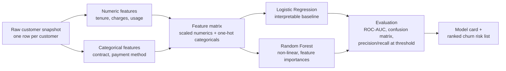
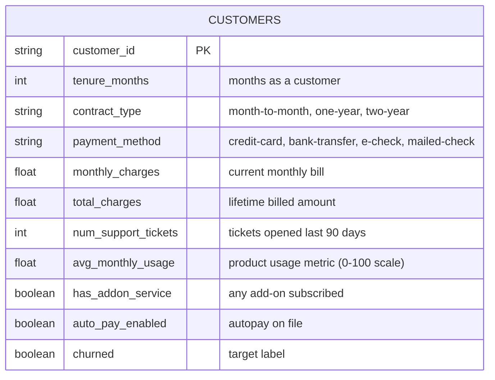

# Design Document — Churn Prediction Model

## a. Problem & Requirements

**Business question:** Which active subscription/retail customers are at high risk of churning next
month, and which factors are driving that risk? A ranked, explainable risk score lets a retention team
prioritize outreach (discounts, check-in calls) toward the customers most likely to leave and most worth
saving, instead of contacting everyone.

**Audience:** Retention/CRM team and the analytics team supporting them.

**Requirements:**
- Binary classification: will this customer churn in the next billing period (1) or not (0)?
- Compare at least two model families (Logistic Regression as an interpretable baseline, Random Forest
  for a stronger non-linear model) and report which wins and by how much.
- Surface feature importance so retention teams understand *why* a customer is flagged, not just that
  they are.
- Be honest about model limitations (class imbalance, synthetic-data caveats) via a model card.

**Non-goals:** prescribing specific retention offers, real-time scoring infrastructure, causal
uplift modeling (this predicts risk, it does not estimate the effect of an intervention).

## b. Data / Feature Flow

This is an ML notebook project without multiple relational tables, so the diagram below shows the
raw-data -> features -> model -> output pipeline, plus the schema of the one input table.



Input schema (`customers`):



## c. Data Dictionary

| Column | Type | Nullable | Description | Example |
|---|---|---|---|---|
| customer_id | STRING | No | Unique customer identifier (PK) | CUST_004821 |
| tenure_months | INT | No | Months since signup | 14 |
| contract_type | STRING | No | Contract commitment length | month-to-month |
| payment_method | STRING | No | Billing payment method | e-check |
| monthly_charges | FLOAT | No | Current monthly bill amount ($) | 74.35 |
| total_charges | FLOAT | No | Cumulative amount billed to date ($) | 1041.20 |
| num_support_tickets | INT | No | Support tickets opened in the last 90 days | 3 |
| avg_monthly_usage | FLOAT | No | Normalized product-usage score, 0-100 | 42.1 |
| has_addon_service | BOOL | No | Whether customer has any add-on subscribed | 1 |
| auto_pay_enabled | BOOL | No | Whether autopay is on file | 0 |
| churned | BOOL | No | Target: churned within the next billing period | 1 |

## d. Schema Design

Grain is one row per customer (a snapshot at a point in time), not a time series — churn models in
practice are usually trained on a monthly snapshot table like this one, where the label looks forward one
billing period. This keeps the modeling problem a standard tabular classification task while still
reflecting how churn datasets are actually assembled in a warehouse (a scheduled snapshot job, not raw
event logs).

Equivalent SQL DDL:

```sql
CREATE TABLE customers (
    customer_id           STRING   NOT NULL,
    tenure_months          INT64    NOT NULL,
    contract_type          STRING   NOT NULL,
    payment_method         STRING   NOT NULL,
    monthly_charges        FLOAT64  NOT NULL,
    total_charges           FLOAT64  NOT NULL,
    num_support_tickets    INT64    NOT NULL,
    avg_monthly_usage      FLOAT64  NOT NULL,
    has_addon_service      BOOL     NOT NULL,
    auto_pay_enabled       BOOL     NOT NULL,
    churned                 BOOL     NOT NULL,
    PRIMARY KEY (customer_id) NOT ENFORCED
);
```

### Key design choices

- **One row per customer, not per event.** Churn prediction is decision-time, not event-time: the
  retention team needs one score per customer per scoring run, so the model is trained on a matching
  grain. `src/data_generation.py` builds `total_charges` as a function of `tenure_months *
  monthly_charges` (with noise) precisely to mimic how this column would be derived from a real billing
  event history rather than invented independently — a common real-world FK-shaped dependency even though
  there's only one table here.
- **Class imbalance is deliberate.** The synthetic generator targets a ~26% churn rate (realistic for
  subscription businesses), not 50/50 — the notebook evaluates with ROC-AUC and a confusion matrix rather
  than accuracy alone, since accuracy is misleading under imbalance.
- **Categorical encoding.** `contract_type` and `payment_method` are one-hot encoded rather than ordinal,
  since there's no natural ordering (month-to-month vs one-year vs two-year is not linearly spaced in its
  effect on churn — month-to-month customers churn far more than the gap between one-year and two-year
  would suggest).
- **Logistic Regression + Random Forest, not just one model.** Logistic Regression's coefficients give a
  directly interpretable "each factor's effect" story for the model card; Random Forest is included to
  check whether non-linear interactions (e.g. low usage *and* high support tickets) meaningfully improve
  on the linear baseline, and its impurity-based feature importances cross-check the logistic
  coefficients.
